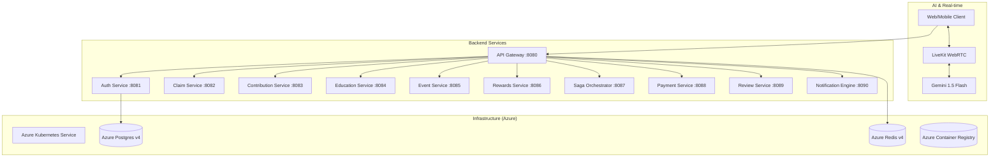

# NSIP - National Social Insurance Platform

A production-ready, microservices-based social insurance platform built with Spring Boot 3.2.5, JDK 17, and Hexagonal Architecture. Now enhanced with **Multimodal AI Capabilities** and **Azure AKS Deployment**.

## 🏗 Architecture



## 🛡 Hardening Features
- **Multimodal AI Assistant**: Integrated LiveKit + Gemini 1.5 Flash for real-time Voice, Video, and Text interaction.
- **Azure Hardened Infrastructure**: Deployed on AKS in `southeastasia` with managed Postgres and Redis.
- **Distributed Tracing**: Automatic `X-Correlation-ID` propagation across all services.
- **API Resilience**: Circuit Breakers (Resilience4j) and Redis-based Rate Limiting at the Gateway.
- **Hexagonal Architecture**: Strict separation of domain logic from infrastructure adapters.

## 🚀 Getting Started

### Prerequisites
- JDK 17 & Maven 3.9+
- Docker & Azure CLI
- LiveKit Cloud Account & Google AI Studio Key

### Azure Deployment (CI/CD)
1. **Provision Infrastructure**:
   ```bash
   cd azure/terraform
   terraform init && terraform apply
   ```
2. **Trigger Workflow**: Push to `main` to trigger `.github/workflows/deploy-azure.yml`.

### Local Development
1. **Build the Platform**: `mvn clean install -DskipTests`
2. **Run Infrastructure**: `docker-compose up -d`
3. **Run Services**: `./run-locally.sh`

## 📂 Repository Structure
- `/backend`: Java microservices and `nsip-common`.
- `/frontend-web`: Material UI React portal with LiveKit Assistant.
- `/azure`: Terraform scripts and Cloud configuration.
- `/k8s`: Kubernetes manifests for Production (v4).

## 📝 License
Proprietary - National Social Insurance Authority.
