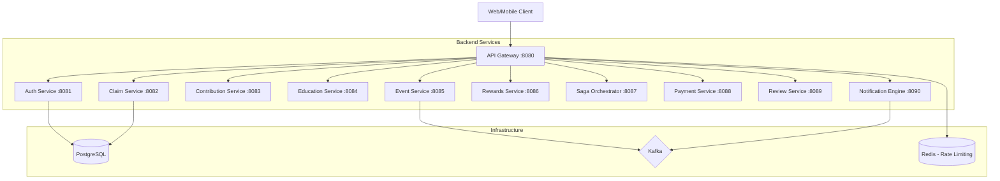

# NSIP - National Social Insurance Platform

A production-ready, microservices-based social insurance platform built with Spring Boot 3.2.5, JDK 17, and Hexagonal Architecture.

## 🏗 Architecture



## 🛡 Hardening Features
- **Distributed Tracing**: Automatic `X-Correlation-ID` propagation across all services.
- **API Resilience**: Circuit Breakers (Resilience4j) and Redis-based Rate Limiting at the Gateway.
- **Hexagonal Architecture**: Strict separation of domain logic from infrastructure adapters.
- **Container Health**: Integrated Docker Health Checks for self-healing orchestration.
- **Security**: Centralized Global Exception Handling and restricted CORS policies.

## 🚀 Getting Started

### Prerequisites
- JDK 17
- Maven 3.9+
- Docker & Docker Compose

### Quick Start
1. **Build the Platform**:
   ```bash
   mvn clean install -DskipTests
   ```
2. **Launch Infrastructure**:
   ```bash
   docker-compose up -d
   ```
3. **Run Services Locally**:
   Use the provided script:
   ```bash
   ./run-locally.sh
   ```

## 📂 Repository Structure
- `/backend`: Java microservices and shared `nsip-common` library.
- `/frontend-web`: Material UI React portal.
- `/frontend-mobile`: Flutter-based mobile application.
- `/k8s`: Kubernetes manifests for production deployment.
- `/legacy`: Archive of previous platform iterations.

## 📝 License
Proprietary - National Social Insurance Authority.
