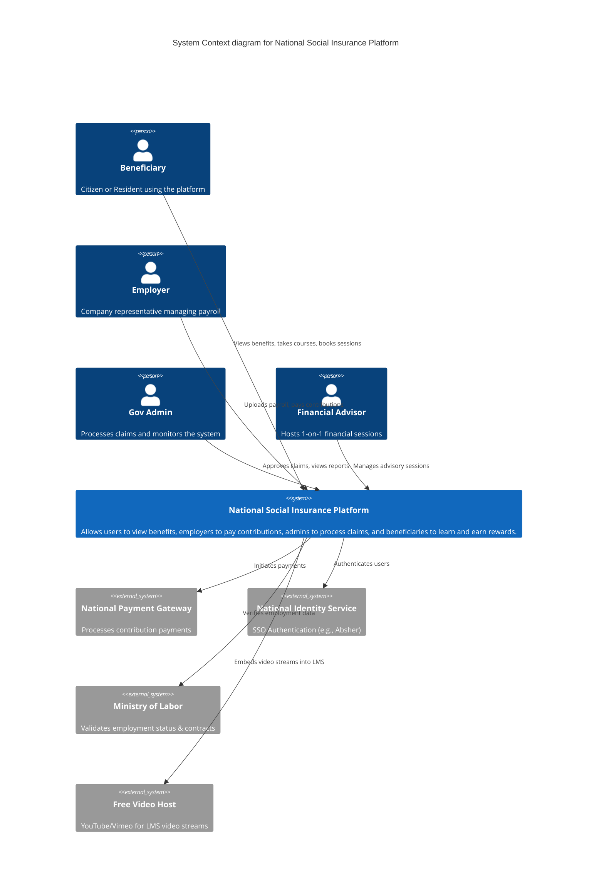
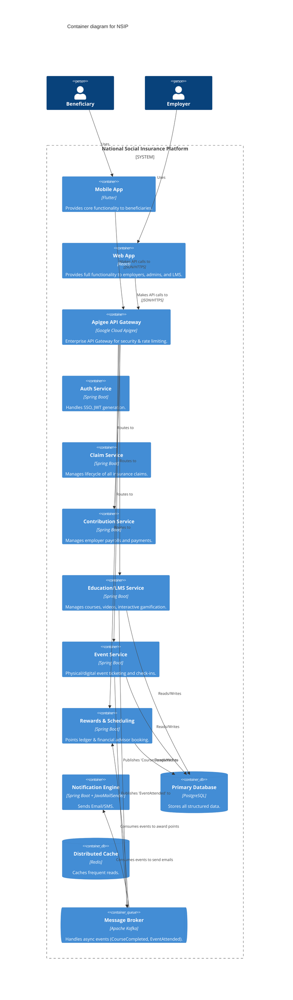

# Architecture High-Level Design (C4 Model)

This document contains the System Context (Level 1) and Container (Level 2) diagrams for the National Social Insurance Platform, updated to include the Financial Learning & Gamification expansion.

## Level 1: System Context Diagram

## Level 2: Container Diagram

