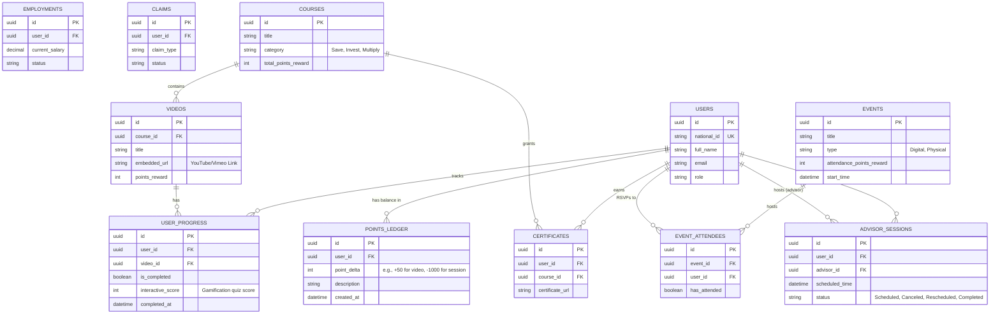

# Entity Relationship Diagram (ERD)

This diagram outlines the relational database schema (PostgreSQL) for the National Social Insurance Platform, updated with the new LMS and Gamification entities.

