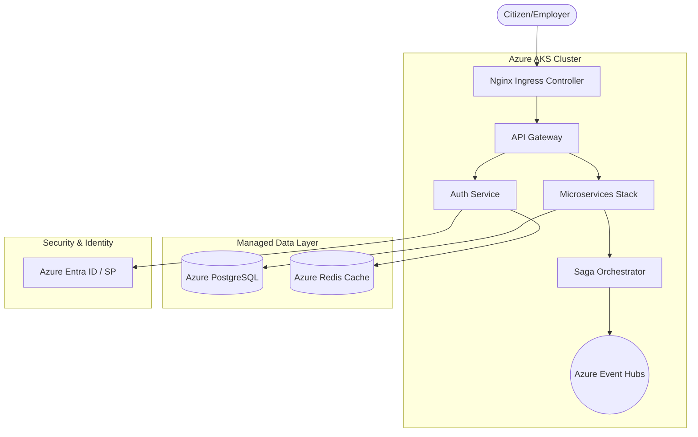
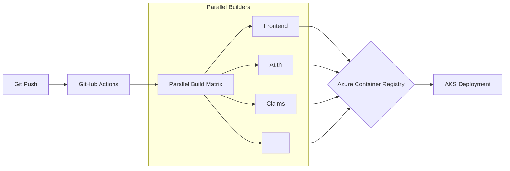
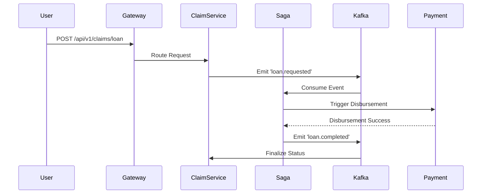

# 07. LLD Diagrams (Cloud Architecture)

This document visualizes the production-ready infrastructure and service orchestration on Azure.

## 1. Cloud Infrastructure Overview (Azure)

## 2. CI/CD Pipeline (GitHub Actions)

## 3. Data Flow: Loan Request (Saga Pattern)

